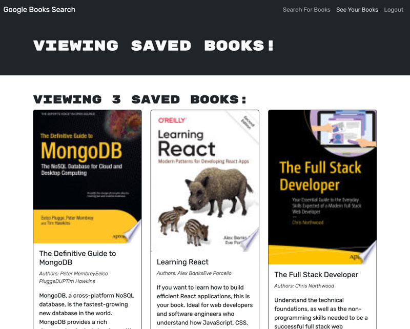

# Book Search Engine

In this project, I converted a full-stack MERN app from REST API routes to an Apollo GraphQL server. 

On the server side, the schemas, including resolvers and typeDefs had to be created, the auth.js had to be modified, and the server.js needed to be configured to run the Apollo server.

On the client side, I created mutations and queries utils, modified most of the React JSX components, and removed any unnecessary API routes.

## The App

This web app enables a user to search for books and save them, by creating an account and logging in. The tech stack includes: JavaScript and Node.js, Express, MongoDB, Mongoose, React, Vite, Bcrypt, JWT, and Bootstrap.

